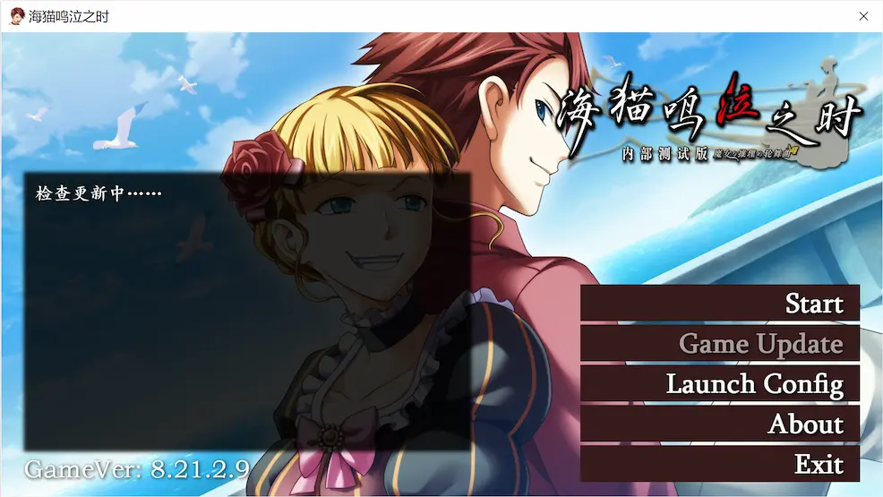

# 海猫鸣泣之时 移植版启动器
Umineko-Project-CN 所使用的启动器/更新器。

## 功能
* 启动游戏引擎
* 更新游戏文件
* 显示官方公告
* 更改游戏设置
## 截图
### V 1.1.0.0

### V 1.0.0.0

## 致谢
* 感谢 [Lumi](https://github.com/LumiLuminas) 精心设计的界面
* 更新功能参考 [ravibpatel](https://github.com/ravibpatel) 的 [AutoUpdater.NET](https://github.com/ravibpatel/AutoUpdater.NET) 项目

## Modernization
当前仓库正在进行现代化重构，优先完成：
- 升级到 `.NET 10`
- 保持 `WPF` 作为临时前端
- 提取 `Core` 与 `Application` 层
- 改为现代 .NET 单文件发布流程
- 将更新器重构为可替换的 `IUpdateService`

参考文档：
- `docs/behavior-baseline.md`
- `docs/modernization.md`
